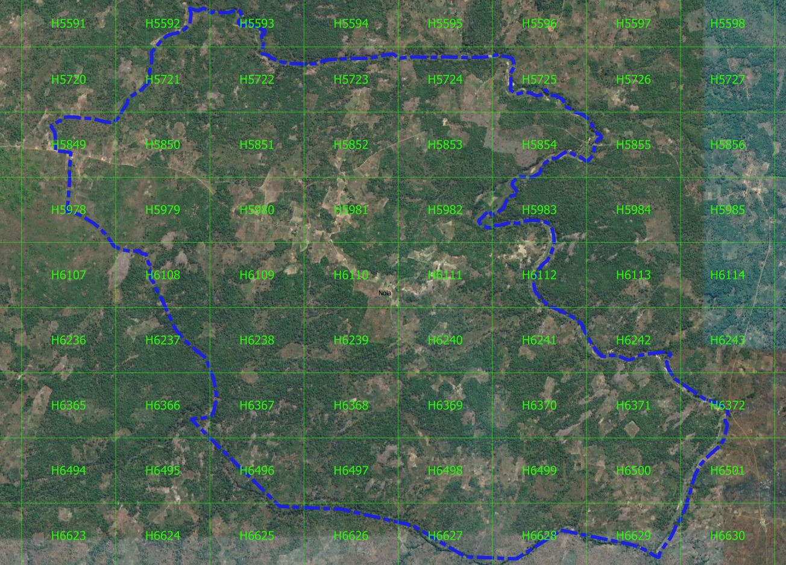

# Produção de Grelha e Mapas

## **Objectivo**

Produzir e imprimir um conjunto de mapas na escala 1:3,000 para servir como a base de mapeamento das parcelas individuais e/ou familiares.

## Processo

* A delimitação dos limites dos povoados já feita anteriormente, servirá para identificar a área dentro da qual a delimitação das parcelas familiares vai ser feita. 
* Cada povoado é um bloco cadastral.
* A equipa do escritório usa uma grelha que cobre a área total do projecto. Cada telha da grelha representa um mapa, com dimensões de 870m x 600m. 
* Estes mapas são produzidos em formato A3, em escala 1:3,000, com base em imagens de satélite. Esta serie de mapas é designada como serie 'H'.
* A equipa do escritório primeiro produz um mapa tipo 'Visão Geral', que mostra como todos os mapas dum bloco cadastral estão organizados e enumerados.
* Depois, a equipa técnica do escritório produz o conjunto de mapas para o bloco cadastral. A equipa do escritório envia para a equipa do campo, em formato PDF, que por sua vez imprime os mapas no papel de tamanho A3.
* Estes mapas oferecem uma escala suficiente para a identificação de parcelas individuais e/ou familiares \(visualizando por exemplo árvores, _machambas_, casas de alvenaria e de zinco\), infraestruturas comunitárias \(p.e. estradas, caminhos, escolas, postos de saúde e pontes\), plantações e áreas de floresta.

> 
>
> Imagem da grelha para um povoado da comunidade de Malalo

## **Ferramentas**

* Mapas e imagens no sistema QGIS

## **Produtos**

* Conjunto de mapas de serie 'H', em formato A3 na escala de 1:3,000, cobrindo toda a área de bloco cadastral
* Mapas com a grelha \(Visão Geral\) de todos mapas de serie 'H'

