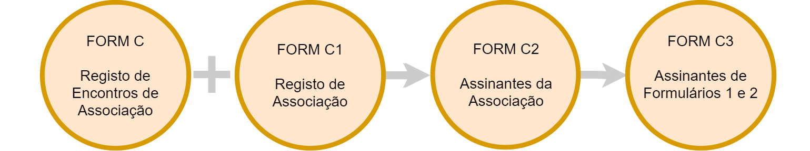

# Formulários ODK

## Formulário C: Registo de encontros de associação

* Usar para gravar informação geral durante os encontros no processo de formação das associações. 
* Vai ser usado várias vezes em cada sítio onde vai se estabelecer uma associação.
* Tem que ser preenchido no fim do encontro, porque requer uma foto dos participantes e as coordenadas do encontro.

## Formulário C1: Registo da associação

* Para recolher informação inicial da associação que vai ser criada \(nome da associação, os nomes dos povoados e número de famílias dos povoados que fazem parte da associação\).
* Vai ser usado uma só vez em cada sítio onde vai se estabelecer uma associação.
* Pode ser preenchido no escritório, porque não requer nem foto nem as coordenadas.

## Formulário C2: Registo dos assinantes da associação

* Para recolher os nomes de pelo menos 10 membros fundadores da nova associação.
* Deve ser preenchido para cada membro. Pode ser preenchido e a informação enviada várias vezes, por exemplo o motivador pode enviar alguns nomes num dia e outros nomes no dia seguinte.
* Tem que ser preenchido depois de envio de formulário C1, porque a equipa técnica em Maputo tem que incluir o nome da associação. 
* Tem que ser preenchido durante o encontro, porque requer assinaturas digitais e fotos dos membros fundadores.
* Será possível fazer registo de algumas pessoas num dia e enviar o formulário, e preencher um outro formulário C2 com membros adicionais da mesma associação num outro dia.

## Formulário C3: Registo dos assinantes do Formulário 1 do Anexo Técnico

* Para recolher informação dos membros da comunidade e dos facilitadores para o pedido de delimitação da terra da associação, para fim de preencher o Formulário 1 de Anexo Técnico \(A.T.\).
* Vai ser usado uma só vez em cada sítio onde vai se estabelecer uma associação.
* Tem que ser preenchido no fim do encontro, porque requer assinaturas digitais e fotos das pessoas que estão a preencher o Formulário 1 do A.T. 

