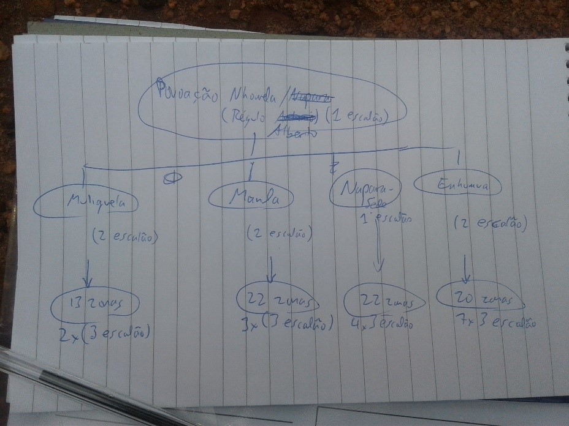
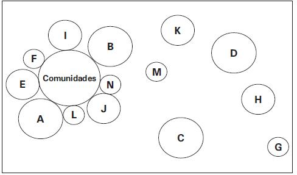

# Organização Social

A organização social da comunidade tem em vista fornecer informações e conhecimento de base no que diz respeito às estruturas e hierarquia da comunidade. O processo envolve desenvolvimento de dois diagramas: um diagrama de Venn e um diagrama de hierarquia.

## Objectivos

Descrever a organização social da comunidade em termos de organizações influentes e em termos de hierarquia da liderança.

## Processo

1. Explicar o objectivo do trabalho;
2. Estabelecer critérios para a selecção dos membros da comunidade a participar no trabalho \(deve ser um número limitado, 10-15 pessoas\). Os principais critérios podem ser o nivel de conhecimento da organização da comunidade e se a pessoa exercer uma função na comunidade ou ser influente na comunidade
3. Para o trabalho, quando for possível pode se fazer em dois grupos em paralelo, com mulheres e homens separados.

## Hierarquia da liderança

* Os participantes descrevem a estrutura administrativa da comunidade
* Membros da comunidade identificam pessoas influentes, como régulos de primeira, segunda e terceira escala, chefes das zonas, e representantes do governo dos vários níveis
* O motivador escreve num papel gigante ou no chao; capturando os tipos, localização e ordem na hierarquia
* Desenhar um diagrama tipo organograma
* Tirar foto do desenho

> 
>
> Diagrama de Hierarquia: Estrutura da liderança duma comunidade

## Diagrama de Venn

É um instrumento para a análise das comunidades vizinhas e das instituições influentes em uma comunidade, e de relacionamento desta com as instituições. Essa técnica permite conhecer, do ponto de vista de um grupo ou indivíduo, a importância e efetiva atuação institucional.

* O motivador desenha um circulo grande no papel ou no chão, representando a comunidade
* Perguntar quais são as comunidades vizinhas e as instituições dentro da comunidade \(p.e. associações comunitárias, sector privado, sector religioso, representantes do governo, partidos políticos, etc.\). Escreve cada um num papel; podes usar um símbolo para os que não sabem ler e escrever.
* Perguntar quais são as instituições de fora que fazem algum trabalho com a comunidade \(p.e. ministérios do governo, organizações não-governamentais, sector privado e outros\). Escrever cada um num papel; pode se usar um símbolo para os que não sabem ler e escrever.
* Para cada instituição:
  * Procurar saber sobre o tipo de relacionamento com a comunidade, o dos benefícios ou problemas;
  * Perguntar quais são mais importantes para a comunidade. O tamanho dos círculos é definido pela importância da instituição. Para as mais importantes, desenhar um circulo maior com símbolo dentro. Para as que são menos importantes, desenhar um círculo menor.
* Colocar os símbolos perto de circulo da comunidade. Pôr os símbolos que representam instituições internas, dentro do círculo da comunidade.
* Pôr os símbolos dos que representam instituições externas fora do círculo da comunidade. Quanto mais próximo, mais atende às necessidades da comunidade.
* Mencionar que uma instituição pode ser importante, mas não ter efetiva atuação na comunidade.

> 
>
> Diagrama de Venn: Importância e actuação de instituições externas

1. Analisar os diagramas feitos pelas mulheres e homens, notando semelhanças e diferenças.
2. Tirar fotos dos desenhos.
3. Concordar o objectivo, processo, local e hora da próxima actividade;
4. Preencher e enviar os Formulários D e F.

## Ferramentas

* Formulário D: Encontro de Diagnóstico Participativo
* Formulário F: Organização Social
* Formulário A1: Pontos de Interesse \(opcional\)

## Produtos

* Coordenadas do local da realização do encontro
* Imagens do diagrama da Venn e da hierarquia da liderança

