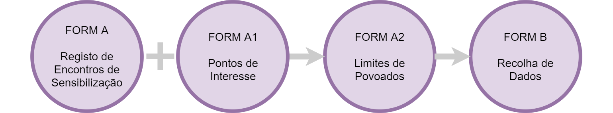

# Formulários ODK

## Formulário A: Registo de Encontros de Sensibilização

* Usar para gravar informação geral durante os encontros no processo de sensibilização
* Vai ser usado várias vezes em cada sítio onde haja actividades de

  sensibilização

* Tem que ser preenchido no fim do encontro, porque requer uma foto dos participantes e as coordenadas geográficas do encontro.

## Formulário B: Registo de Pontos de Interesse

* Usar para gravar informação de pontos de interesse, em particular antes ou depois de encontros.
* Vai ser usado várias vezes em cada povoado, gravando informação dum ponto de interesse por vez.
* Tem que ser preenchido no local, porque requer uma foto e as coordenadas geográficas.

## 

